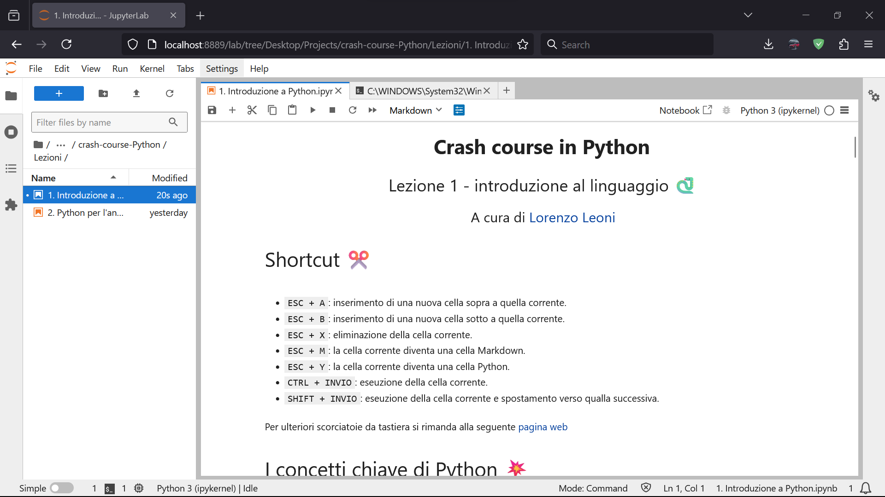

# Crash course in Python - AA 2025/2026

## Nota
Si consiglia di **clonare** il repository per avere sempre a portata di fetch e pull le ultime modifiche e aggiornamenti.

## Chi sono 👋
Ciao a tutti, mi chiamo **Lorenzo Leoni**, ho 27 anni e lavoro come data scientist in [Tesmec](https://www.tesmec.com/it), un'azienda specializzata nella produzione di macchinari per infrastrutture destinate al trasporto energetico. Ho conseguito la laurea magistrale in ingegneria informatica seguendo il percorso DSDE (Data Science and Data Engineering), che mi ha permesso di approfondire sia le competenze di analisi dei dati sia gli aspetti ingegneristici del settore. A partire da dicembre 2023, sono anche tutor di statistica e collaboro con il prof. Metulini e la dott.ssa Giampino. Per chi volesse contattarmi o conoscermi meglio, ecco i miei recapiti:
- **Email**: lorenzo.leoni1998@gmail.com
- **GitHub**: [https://github.com/lamferzon](https://github.com/lamferzon)
- **LinkedIn**: [https://www.linkedin.com/in/lorenzo-leoni-273399265/](https://www.linkedin.com/in/lorenzo-leoni-273399265/)

#


## Python e l'analisi dati 📊
Python è uno degli strumenti più potenti e versatili per il data analytics. Grazie alla sua semplicità sintattica e all'ampia gamma di librerie dedicate, come [Pandas](https://pandas.pydata.org/), [NumPy](https://numpy.org/), [Seaborn](https://seaborn.pydata.org/) e [scikit-learn](https://scikit-learn.org/stable/), questo linguaggio consente di raccogliere, pulire, visualizzare e analizzare grandi quantità di dati con facilità. La sua vasta comunità di sviluppatori e data scientist contribuisce continuamente a migliorare queste librerie, rendendo Python una scelta fondamentale per chi vuole affrontare progetti di analisi dei dati in modo rapido e scalabile.

## Struttura del corso 💪

|    #    |            Lezione            |          Descrizione          |        Disponibile       | In presenza |
|---------|-------------------------------|-------------------------------|--------------------------|-------------|
|    1    | [**Introduzione a Python**](Lezioni/1.%20Introduzione%20a%20Python.ipynb)     | Basi del linguaggio           | Sì                       | No          |
|    2    | [**Python per l'analisi dati**](Lezioni/2.%20Python%20per%20l'analisi%20dati.ipynb) | Introduzione alle librerie    | Sì                | No          |
|    3    | [**Caso di studio**](Lezioni/3.%20Caso%20di%20studio.ipynb)            | Esempio di model training     | Sì               | Sì          |

**Nota**: si consiglia la visione delle prime due lezioni prima dell'esercitazione in presenza in programma nella prima metà di dicembre.

## Anaconda e JupyterLab 🐍
**Anaconda** è una distribuzione open-source di Python e R progettata per facilitare il lavoro di data science e machine learning. Include oltre 1.500 pacchetti preinstallati e strumenti per la gestione dei pacchetti e degli ambienti. Invece, **JupyterLab** è un ambiente di sviluppo interattivo open-source per la programmazione e l'analisi dati. È il successore di **Jupyter Notebook** e offre un'interfaccia più moderna e flessibile. JupyterLab consente di combinare codice eseguibile, testo (in Markdown), visualizzazioni, e documentazione all'interno di un'unica interfaccia.

### Installazione di Anaconda

1. **Visitare il sito ufficiale** della distribuzione [Anaconda](https://www.anaconda.com/download). Per i requisiti minimi, premere il seguente [link](https://docs.anaconda.com/ae-notebooks/system-requirements/).
2. Nella sezione *Provide email to download Distribution*, **cliccare sul pulsante** *Skip registration* per procedere al download senza registrazione.
3. **Scegliere la versione** da scaricare (Python 3.12) in base al proprio sistema operativo.
4. Una volta completato il download (circa 1 GB), **eseguire il file .exe** scaricato.
   - **Premere** *Next*.
   - **Accettare i termini** contrattuali.
   - **Scegliere il tipo di installazione**: si consiglia di selezionare *Just Me* e premere *Next*.
   - **Scegliere la cartella** dove installare Anaconda e premere *Next*.
   - **Mantenere le spunte** per *Create shortcuts* e *Register Anaconda3 as my default Python 3.12*, quindi premere *Install*. In particolare, si consiglia di mantenere la seconda spunta poiché consente a IDE di terze parti (es. Visual Studio Code) di accedere automaticamente agli ambienti virtuali definiti in Anaconda.
   - **Premere** *Next* due volte.
   - **Premere** *Finish*.
5. **(Opzionale)** Testare l'installazione aprendo il terminale di Anaconda (**Anaconda Prompt**, che puoi trovare cercandolo nella barra di ricerca di Windows) e lanciando un semplice comando come ```python --version``` per verificare che tutto sia andato a buon fine.

### Principali comandi per il Prompt di Anaconda

|          Comando          |                    Descrizione                    |
|---------------------------|---------------------------------------------------|
| `python --version`        | Visualizza la versione di Python installata       |
| `conda --version`         | Visualizza la versione di Anaconda installata     |
| `conda create --name nome_ambiente python=3.12` | Crea un nuovo ambiente virtuale con una versione specifica di Python |
| `conda activate nome_ambiente` | Attiva l'ambiente virtuale specificato       |
| `conda deactivate`             | Disattiva l'ambiente virtuale corrente       |
| `conda install nome_pacchetto` | Installa un pacchetto utilizzando Conda      |
| `pip install nome_pacchetto`   | Installa un pacchetto utilizzando pip (se non disponibile su Conda) |
| `conda list`                   | Visualizza l'elenco dei pacchetti installati nell'ambiente attivo   |
| `conda update nome_pacchetto`  | Aggiorna un pacchetto specifico                                     |
| `conda remove nome_pacchetto`  | Rimuove un pacchetto dall'ambiente attivo                           |
| `conda remove --name nome_ambiente --all` | Elimina un ambiente virtuale                             |
| `conda env list`               | Visualizza la lista di tutti gli ambienti disponibili               |

### Avvio di JupyterLab

1. **Scarica** il contenuto della cartella *Lezioni*.
2. **Avvia JupyterLab** tramite l'interfaccia **Anaconda Navigator**, che puoi trovare cercandolo nella barra di ricerca di Windows.
3. **Accedi alla cartella** in cui hai scaricato il contenuto di *Lezioni* utilizzando il file explorer di JupyterLab.
4. **Apri e esegui** i notebook all'interno della cartella.

#

